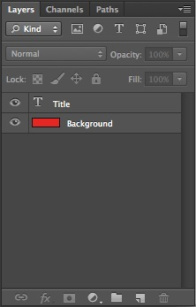

# Supreme Logo Generator

	

The Supreme Logo Generator is a project built for fun. It serves to generate [Supreme Box Logos](https://en.wikipedia.org/wiki/Supreme_(brand)) from the data stored on a CSV file and export these logos to PNG image files.

## Getting Started

### Prerequisites

*Note: This program has only been tested on Adobe Photoshop CS6.*

Prior to the installation of the script, other programs and files need to be installed onto the user's local machine for the script to work correctly.

#### Adobe Photoshop

Since this is a script for Adobe Photoshop, the user must have a copy of Adobe Photoshop installed. Adobe Photoshop can be purchased and downloaded from Adobe's official website [here](https://www.adobe.com/photoshop).

#### Futura Font

The font used for Supreme Box Logos is Futura Std Heavy Oblique. The user should have this font downloaded and installed on their local machine if they want the logos to come out looking correctly. Running the script without downloading the font before will cause Adobe Photoshop to select a default font and generate the logos with that font rather than Futura.

The download for Futura Std Heavy Oblique can be found on [Fontsgeek.com](http://fontsgeek.com/fonts/Futura-Std-Heavy-Oblique).

Instructions for installing font on local machine (courtesy of Fontspring):
* [Windows](https://www.fontspring.com/support/how-do-i-install-fonts-on-my-windows-pc)
* [Mac](https://www.fontspring.com/support/how-do-i-install-fonts-on-my-mac)

### Installing

To install a copy of the project, navigate to the top of the [page](https://github.com/haanmiba/Supreme-Logo-Generator) for the Supreme Logo Generator GitHub repository and click on the green button on the right side for **Clone or download** and then click on **Download ZIP**.

	

Once the .zip file has been downloaded, unzip the file, and now there should be a folder called "Supreme-Logo-Generator-master". Feel free to move this folder to any directory as long as it can be easily found.

## Running the Program

Once the user has installed Adobe Photoshop, Futura, and unzipped a copy of this repository on their local machine, they should be set to run the script and begin generating Supreme Box Logos.

### Step 1: Adding Data to CSV Files

The way the program works is that the script prompts the user to select a CSV file to generate images from. The CSV file must be formatted in a certain way in order for the script to parse the data correctly.

#### CSV File Layout

In the unzipped Supreme Logo Generator folder is a folder called **_source-csv-files_**. Within this folder are CSV files that can be edited and modified to add data to create logos. The program uses three different ways to represent colors in a CSV file:

* [HEX](https://www.w3schools.com/colors/colors_hexadecimal.asp) (ex. #FF0000 is red)
* [Shorthand HEX](http://www.websiteoptimization.com/speed/tweak/hex/) (ex. shorthand hex equivalent of #FF0000 is #F00)
* [RGB](https://www.w3schools.com/colors/colors_rgb.asp) (ex. (255, 0, 0) is red)

Likewise, there are three different CSV files that utilize these different ways to represent color. Select one that you may find most suitable. The following example will be done in regular HEX on the Source-Hex.csv file.

Source-Hex.csv:

| FILE_NAME     | TITLE   | TITLE_COLOR | BACKGROUND_COLOR |
|---------------|---------|-------------|------------------|
| Supreme-Red   | Supreme | #FFFFFF     | #E42621          |
| Supreme-Green | Supreme | #FFFFFF     | #00FF00          |
| Supreme-Blue  | Supreme | #FFFFFF     | #0000FF          |

From left to right:

1. **FILE_NAME** - The name of the file once it has been generated. No need to add the .PNG extension at the end, the program will take care of this.
2. **TITLE** - The foreground text of the logo.
3. **TITLE_COLOR** - The color of the foreground text.
4. **BACKGROUND_COLOR** - The color of the background.

	

To generate a new logo, all that is needed is to add a new row to the CSV file with the corresponding information in its appropriate locations.

For example, say that we wish to create a new logo with the text "John Smith", white text (#FFFFFF) over a blue background (#0000FF). All that would need to be done is to add the following row to the CSV file:

| FILE_NAME     | TITLE      | TITLE_COLOR | BACKGROUND_COLOR |
|---------------|------------|-------------|------------------|
| John          | John Smith | #FFFFFF     | #0000FF          |

If we wish to do the same thing but using RGB, open up Source-RGB.csv and we enter this row to the CSV file:

| FILE_NAME | TITLE      | TITLE_RED | TITLE_GREEN | TITLE_BLUE | BACKGROUND_RED | BACKGROUND_GREEN | BACKGROUND_BLUE |
|-----------|------------|-----------|-------------|------------|----------------|------------------|-----------------|
| John      | John Smith | 255       | 255         | 255        | 0              | 0                | 255             |

Continue to do this until the CSV file contains all of the data for all of the logos that will be generated.

### Step 2: Open Up Adobe Photoshop

Launch Adobe Photoshop. There is a .psd file within the unzipped folder titled **_Supreme Box Logo Template.psd_**. This file contains only two layers: Title and Background. Open this file.

	

**_Note: Do NOT change the names of these layers in Photoshop, it will cause the script to fail._**

### Step 3: Launching the Script

Navigate to the top menu bar and select **_File > Scripts > Browse..._**.

	 Scripts > Browse... Screenshot" src="media/Photoshop-File-Scripts-Browse-Screenshot.jpg" />

After clicking on **_Browse..._**, Adobe Photoshop will prompt you to select a JavaScript file within your local machine. Navigate to where you placed the "Supreme-Logo-Generator-master" folder. Select **_Supreme Logo Generator.js_** to launch the script.

	

### Step 4: Select a CSV File

Upon launching the script, Adobe Photoshop will prompt you to select a CSV file that contains data to generate logos from.

	

	

